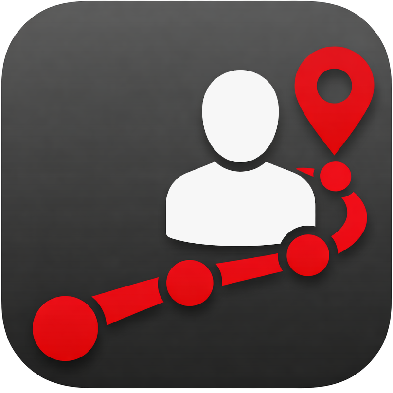

# SOP-ZNA – Patientenpfade Zentrale Notaufnahme

<div align="center">
  
  <br><br>
  
  <br><br>
  <p><strong>73 evidenzbasierte Standard Operating Procedures für die Notfallmedizin</strong></p>
</div>

---

## Übersicht

SOP-ZNA ist eine Progressive Web Application zur Darstellung klinischer Standard Operating Procedures (SOPs) für die Zentrale Notaufnahme des Klinikums St. Georg Leipzig. Die Anwendung bietet medizinischem Personal schnellen Zugriff auf 73 evidenzbasierte Patientenpfade – optimiert für Desktop, Tablet und Smartphone mit nativer mobiler UX.

### Kernmerkmale

Die Anwendung wurde entwickelt, um die kognitive Last für Notfallpersonal zu minimieren. Durch intuitive Navigation, visuelle Hierarchie und flüssige Animationen können sich Ärzte und Pflegekräfte vollständig auf die Patientenversorgung konzentrieren, ohne sich in die Anwendung "einlernen" zu müssen.

---

## Neue Funktionen (Version 2.0)

### 1. Native Push & Pop Navigation

Die Navigation zwischen Ansichten erfolgt nun mit nativen Smartphone-Übergängen, die dem mentalen Modell der Navigationstiefe entsprechen:

- **Vorwärts:** Beim Öffnen einer SOP wischen neue Screens von rechts nach links herein
- **Zurück:** Beim Zurückgehen wischt der aktuelle Screen nach rechts heraus
- **History-Stack:** Vollständige Verwaltung der Navigationshistorie für konsistentes Navigieren
- **GPU-beschleunigt:** Alle Animationen laufen mit 60fps durch CSS-Transform und Opacity

Die Animationen nutzen kubische Bézier-Kurven für organische, natürlich wirkende Bewegungen, die iOS und Android Systemübergängen ähneln.

### 2. Swipe-to-Back Gestensteuerung

Für mobile Geräte wurde eine vollständige Wischgeste am linken Bildschirmrand implementiert:

- **Erkennung:** Berührungen im 25px-Randbereich werden als potenzielle Wischgeste erkannt
- **Dominante Richtung:** Horizontale Bewegungen dominieren über vertikale, um versehentliches Auslösen zu vermeiden
- **Visuelles Feedback:** Der aktuelle View wird während des Wischens transparenter und verschiebt sich leicht nach rechts
- **Schwellenwert:** Mindestens 80 Pixel位移 oder entsprechende Geschwindigkeit löst die Zurück-Navigation aus
- **Haptic Feedback:** Leichte Vibration bei erfolgreicher Geste (auf unterstützten Geräten)

Diese Funktion ermöglicht die Einhandbedienung ohne Daumen zum oberen Bildschirmrand strecken zu müssen.

### 3. Interaktives Draggable Bottom Sheet

Das Inhaltsverzeichnis (Section Picker) wurde als vollständig interaktives Bottom Sheet implementiert:

- **Drag-to-Close:** Nutzer können das Sheet durch Herunterziehen schließen
- **Physikalisches Feedback:** Das Sheet folgt der Fingerbewegung in Echtzeit
- **Spring-Animation:** Beim Losen springt das Sheet entweder in die offene Position oder schließt vollständig
- **Handle-Indikator:** Ein Grifffläche oben zeigt die Interaktionsmöglichkeit an
- **Overscroll-Schutz:** Verhindert unerwünschtes Bounce-Verhalten auf iOS

### 4. Segmented Control für SOPs

Unter dem SOP-Titel erscheint eine fixierte Reiter-Leiste für die wichtigsten Bereiche:

- **Schnellnavigation:** Ein Tap auf einen Segment-Button springt sofort zum entsprechenden Bereich
- **"Alle"-Button:** Öffnet alle Sektionen auf einen Klick
- **Autoscroll:** Nach dem Tap wird smooth zum Zielbereich gescrollt
- **Horizontales Scrollen:** Bei mehr als 5 Segmenten horizontal scrollbar
- **Aktive Markierung:** Der aktive Segment-Button wird farblich hervorgehoben

Diese Funktion reduziert die Scroll-Fatigue bei langen SOPs erheblich.

### 5. Card-basiertes Design

Alle Listenansichten wurden von einfachen Linien auf ein moderneres Card-Design umgestellt:

- **Erhöhte Karten:** Leichter Schatten und abgerundete Ecken (16px Radius)
- **Grauer Hintergrund:** Die Cards befinden sich auf einem grauen Surface-Hintergrund
- **Grupierte Anordnung:** Visuelle Grupierung zusammengehöriger Einträge
- **Hover-Effekte:** Leichte Anhebung und Farbverschiebung bei Interaktion
- **Konsistente Abstände:** Einheitliche Padding-Werte für alle Card-Elemente

### 6. Skeleton Screens

Beim Öffnen einer SOP erscheint sofort ein Skeleton-Layout vor dem tatsächlichen Inhalt:

- **Sofortige Anzeige:** Das Skeleton rendert sofort, noch bevor die JS-Daten verarbeitet sind
- **Platzhalter:** Enthält Platzhalter für Badge, Titel, Segmented Control und Sektionskarten
- **Shimmer-Animation:** Fließende Lichtreflexion suggeriert Ladeaktivität
- **GPU-beschleunigt:** Die Shimmer-Animation nutzt CSS gradients ohne JavaScript-Overhead
- **Nahtloser Übergang:** Sobald die Daten ready sind, wird das Skeleton transparent ausgeblendet

### 7. Spotlight-Suche

Eine globale Suche mit iOS Spotlight-Feeling:

- **Modal-Overlay:** Keine neue Seite – die Suche erscheint als Modal über dem aktuellen Inhalt
- **Backdrop-Blur:** Der Hintergrund wird unscharf dargestellt für Fokus auf die Suche
- **Sofortige Tastatur:** Die Tastatur fährt sofort aus
- **Cancel-Button:** Oben rechts für sofortiges Schließen (wie bei iOS Spotlight)
- **Live-Ergebnisse:** Ergebnisse werden während des Tippens aktualisiert
- **Tastaturkürzel:** Ctrl/Cmd + K öffnet die Spotlight-Suche

---

## Funktionen

### SOP-Verwaltung

Die Anwendung enthält 73 klinische SOPs mit strukturierten Sektionen. Jede SOP ist in logische Abschnitte unterteilt: Definition, Ursachen, Symptome, Diagnostik, Therapie, Merke, Disposition, Komplikationen und Quellen. Die Sektionen sind Akkordeons, die Nutzer ein- und ausklappen können. Diagnostik und Therapie sind standardmäßig geöffnet, da sie die wichtigsten Informationen enthalten.

Die SOPs sind in 11 Fachkategorien organisiert: Kardiologie, Pneumologie, Gastroenterologie, Neurologie, Nephrologie, Metabolisch, Hämatologie, Infektiologie, Toxikologie, Leitsymptom und Sonstige. Jede Kategorie hat eine eindeutige Farbcodierung, die sich durch die gesamte Anwendung zieht.

### Suche und Navigation

Die Volltextsuche durchsucht alle SOPs inklusive Titel, Sektionsinhalte und Quellen. Bei Treffern wird ein relevanter Ausschnitt mit dem Suchbegriff hervorgehoben angezeigt. Die Suchergebnisse sind nach Relevanz sortiert, wobei exakte Titelübereinstimmungen höher gewichtet werden.

Die Kategorie-Filter ermöglichen eine schnelle Einschränkung auf eine Fachrichtung. Die Filter können in der Sidebar (Desktop) oder in der Browse-Ansicht (Mobile) gesetzt werden. Ein Breadcrumb zeigt jederzeit die aktuelle Position in der Navigationshierarchie.

### Responsive Design

Die Anwendung ist für alle Bildschirmgrößen optimiert. Auf Desktop-Geräten erscheint eine Sidebar mit Navigation, Suche und Kategorie-Filtern. Auf mobilen Geräten wird die Sidebar ausgeblendet und durch eine Bottom-Navigation ersetzt. Die Touch-Targets sind mindestens 44×44 Pixel groß, wie von Apple empfohlen.

Safe Areas für iOS-Geräte mit Dynamic Island und Home-Indicator werden korrekt berücksichtigt. Das Layout passt sich automatisch an Notch, Dynamic Island und die untere Gestenleiste an.

### Dark Mode

Die Anwendung unterstützt einen vollständigen Dark Mode, der automatisch basierend auf den Systemeinstellungen aktiviert wird. Nutzer können auch manuell zwischen Light und Dark Mode wechseln. Die Einstellung wird im LocalStorage gespeichert und bleibt über Sitzungenhinweg erhalten.

### Schriftgrößenanpassung

Die Schriftgröße kann stufenlos von 13px bis 20px angepasst werden. Diese Einstellung wird ebenfalls persistent gespeichert und verbessert die Lesbarkeit für verschiedene Sehstärken und Nutzungssituationen.

---

## Technische Architektur

### Frontend-Stack

Die Anwendung ist als reine Single-Page-Application ohne Framework-Abhängigkeiten implementiert. Als Sprache dient ES5-kompatibles JavaScript für maximale Browser-Unterstützung. Das Rendering erfolgt vollständig client-seitig durch DOM-Manipulation.

Die Styles sind in einer einzigen CSS-Datei zusammengefasst, die Custom Properties (CSS Variables) für das Theming nutzt. Flexbox und CSS Grid werden für das Layout verwendet, Media Queries für die Responsive-Optimierung.

### Performance-Optimierung

Alle Animationen nutzen GPU-beschleunigte CSS-Eigenschaften (transform, opacity) für flüssige 60fps. Die Shimmer-Animation der Skeleton Screens ist vollständig in CSS implementiert ohne JavaScript-Overhead. Transitions sind mit kubischen Bézier-Kurven optimiert für organische Bewegung.

Throttle- und Debounce-Funktionen begrenzen die Häufigkeit von Event-Handlern bei Scroll- und Resize-Events. Der Intersection Observer API wird für Lazy-Rendering und Scroll-Tracking genutzt.

### Navigation-Stack

Die Implementierung nutzt einen internen History-Stack, der die Navigationshierarchie verwaltet. Jeder Push-Navigation wird der aktuelle Zustand hinzugefügt. Pop-Navigation stellt den vorherigen Zustand wieder her. Die View-Transitions werden synchronisiert mit dem Stack-Ablauf.

### Touch-Gesten

Das Touch-Event-System unterscheidet zwischen verschiedenen Gesten: Swipe-to-Back am linken Rand, Pull-to-Refresh am oberen Rand des Scroll-Bereichs, Draggable-Bottom-Sheet am Picker-Handle. Die Bewegungserkennung nutzt Delta-Berechnungen für X und Y, um die dominante Richtung zu bestimmen.

---

## Projektstruktur

```
sop-zna/
├── index.html              # Einstiegspunkt mit HTML-Struktur
├── app.js                  # Hauptanwendungslogik
├── styles.css              # Vollständiges Stylesheet
├── README.md               # Diese Dokumentation
├── img/
│   ├── Basislogo_farbig.png
│   ├── Patientenpfade.png
│   └── ZNA/                # SOP-spezifische Abbildungen
└── sops/                   # 73 einzelne SOP-Dateien
    ├── abdominelle-schmerzen.js
    ├── herz-kreislauf-stillstand.js
    └── ...                 # 71 weitere SOPs
```

Jede SOP-Datei ist ein eigenständiges JavaScript-Modul, das ein Data-Objekt in das globale SOP_DATA-Array pusht. Das ermöglicht modulares Laden und einfaches Hinzufügen neuer SOPs ohne Build-Prozess.

---

## SOP-Kategorien

| Kategorie | Schlüssel | Farbcode |
|-----------|-----------|----------|
| Kardiologie | `kardio` | #ef4444 (Rot) |
| Pneumologie | `pulmo` | #3b82f6 (Blau) |
| Gastroenterologie | `gi` | #f59e0b (Orange) |
| Neurologie | `neuro` | #8b5cf6 (Violett) |
| Nephrologie | `nephro` | #06b6d4 (Cyan) |
| Metabolisch | `metab` | #10b981 (Grün) |
| Hämatologie | `haem` | #ec4899 (Pink) |
| Infektiologie | `infekt` | #84cc16 (Limette) |
| Toxikologie | `tox` | #f97316 (Dunkelorange) |
| Leitsymptom | `leit` | #6366f1 (Indigo) |
| Sonstige | `sonst` | #64748b (Grau) |

---

## Neue SOP hinzufügen

### SOP-Datei erstellen

Erstellen Sie eine neue Datei unter `sops/` mit folgendem Format:

```javascript
(function() {
    if (!window.SOP_DATA) window.SOP_DATA = [];
    window.SOP_DATA.push({
        id: "eindeutige-id",
        title: "Titel der SOP",
        name: "Titel der SOP",
        category: "kardio",
        stand: "03/26",
        sources: "<p>Quellenangaben...</p>",
        sections: [
            {
                title: "Definition",
                html: "<p>Definitionstext...</p>"
            },
            {
                title: "Ursachen",
                html: "<p>Ursachen...</p>"
            },
            {
                title: "Diagnostik",
                html: "<p>Diagnostische Maßnahmen...</p>"
            },
            {
                title: "Therapie",
                html: "<p>Therapieoptionen...</p>"
            },
            {
                title: "Merke",
                html: "<div class='callout callout-wichtig'>Wichtiger Hinweis!</div>"
            },
            {
                title: "Disposition",
                html: "<p>Weiteres Vorgehen...</p>"
            }
        ]
    });
})();
```

### Script einbinden

Fügen Sie in `index.html` vor `app.js` ein:

```html
<script src="sops/neue-sop.js"></script>
```

### Callout-Klassen

| CSS-Klasse | Bedeutung |
|------------|-----------|
| `callout callout-cave` | Warnung, Kontraindikation |
| `callout callout-wichtig` | Wichtiger Hinweis |
| `callout callout-hinweis` | Tipp oder Hinweis |
| `callout callout-info` | Information |

---

## Browser-Unterstützung

Die Anwendung unterstützt alle modernen Browser mit ES5-Unterstützung:

- Chrome und Edge ab Version 80
- Safari ab Version 14
- Firefox ab Version 78
- Samsung Internet ab Version 13

Für ältere Browser wird die Anwendung ohne Animationen und mit grundlegender Funktionalität dargestellt. Die `prefers-reduced-motion` Medienabfrage deaktiviert alle Animationen auf Wunsch des Nutzers.

---

## Installation und Deployment

### Lokale Entwicklung

Die Anwendung benötigt keinen Build-Prozess und kann direkt im Browser geöffnet werden:

```bash
# Python 3
python3 -m http.server 8080

# Node.js
npx serve .

# PHP
php -S localhost:8080
```

### Produktiv-Deployment

Da es sich um statische Dateien handelt, kann die Anwendung auf jedem Webserver bereitgestellt werden:

- **Apache/Nginx:** Dateien ins Webroot kopieren
- **GitHub Pages:** Automatisches Deployment via Git
- **Netlify/Vercel:** Drag & Drop oder Git-Integration
- **AWS S3:** Statisches Website-Hosting

---

## Autor und Kontakt

**Klinikum St. Georg Leipzig**
AG Klinische Pfade
Zentrale Notaufnahme

---

*Version 2.0 – Februar 2026*
*Alle 73 SOPs vollständig implementiert mit nativer mobiler UX*
