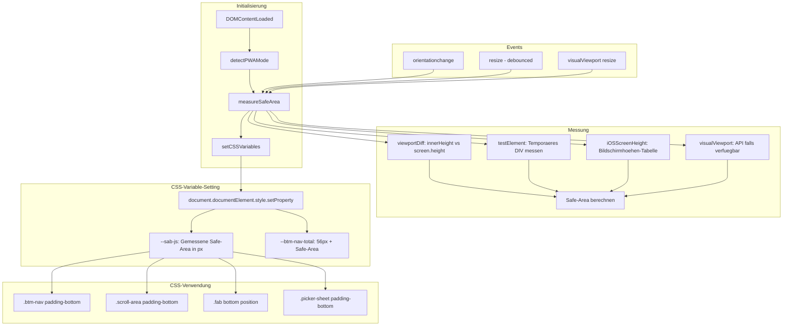

# Architektur-Plan: iOS PWA Safe-Area-Fix (Ungewöhnlicher Ansatz)

## Problemzusammenfassung

Die Debug-Analyse hat folgende Kernprobleme identifiziert:

1. **Inline-Style überschreibt CSS-Logik** (Hauptursache)
   - JavaScript setzt `padding-bottom: 34px` direkt als inline-Style auf `#bottomNav`
   - Dies überschreibt alle CSS-Regeln unabhängig von Spezifität

2. **Fehlende Höhe-Begrenzung**
   - `height: auto` mit `min-height: 56px` führt zu variabler Gesamthöhe (~98px statt ~90px)

3. **Mehrfache padding-bottom-Quellen mit Konfliktpotenzial**
   - CSS Media-Query: `padding-bottom: max(8px, var(--sab, env(...)))`
   - CSS PWA-Fix-Klasse: `padding-bottom: max(8px, var(--sab-override, ...))`
   - JavaScript inline-Style: `bottomNav.style.paddingBottom = safeAreaBottom + 'px'`

4. **env() gibt in iOS PWA 0px zurück**
   - Die CSS-Funktion `env(safe-area-inset-bottom)` liefert im iOS PWA standalone mode oft `0px`

5. **Scroll-Area padding nicht angepasst**
   - `.scroll-area` hat fixes `padding-bottom: 80px` (unabhängig von Safe-Area)

---

## Radikaler Lösungsansatz: JavaScript-basierte Messung ohne inline-Styles

### Kernprinzipien

1. **KEINE inline-Styles** - Nur CSS-Variablen auf `:root` setzen
2. **Eine einzige Quelle für Safe-Area** - Die CSS-Variable `--sab-js`
3. **Feste Höhe für Bottom-Nav** - `height: 56px` + Safe-Area als padding-bottom
4. **Konsolidierte CSS-Regeln** - Alle Elemente nutzen dieselbe Variable

---

## Architektur-Diagramm



---

## Implementierungsdetails

### 1. JavaScript: Safe-Area-Messung zur Laufzeit

**Datei:** `app.js`

**Neue Funktion:** `measureSafeAreaRuntime()`

```javascript
// ============================================
// SAFE AREA RUNTIME MEASUREMENT
// ============================================

var SAFE_AREA_RUNTIME = {
    bottom: 0,
    top: 0,
    isPWA: false,
    isIOS: false,
    lastMeasurement: 0
};

function detectRuntimeEnvironment() {
    // PWA Detection
    var isStandalone = window.matchMedia('(display-mode: standalone)').matches;
    var isIOSStandalone = window.navigator.standalone === true;
    var isAndroidWebApp = document.referrer.indexOf('android-app://') === 0;
    
    SAFE_AREA_RUNTIME.isPWA = isStandalone || isIOSStandalone || isAndroidWebApp;
    
    // iOS Detection
    SAFE_AREA_RUNTIME.isIOS = /iPad|iPhone|iPod/.test(navigator.userAgent);
    
    return SAFE_AREA_RUNTIME.isPWA;
}

function measureSafeAreaRuntime() {
    var measuredBottom = 0;
    
    // Methode 1: iOS Screen Height Lookup Table
    if (SAFE_AREA_RUNTIME.isIOS && SAFE_AREA_RUNTIME.isPWA) {
        var screenH = window.screen.height;
        
        // iPhone Modelle mit Safe-Area (34px)
        var iPhoneWithNotch = [
            812,  // iPhone X, 11 Pro, 12 mini, 13 mini
            844,  // iPhone 12, 12 Pro, 13, 13 Pro, 14
            852,  // iPhone 14 Pro
            896,  // iPhone Xs Max, 11 Pro Max, 12 Pro Max, 13 Pro Max
            926,  // iPhone 12 Pro Max, 13 Pro Max
            932   // iPhone 14 Pro Max
        ];
        
        for (var i = 0; i < iPhoneWithNotch.length; i++) {
            if (screenH >= iPhoneWithNotch[i] - 5 && screenH <= iPhoneWithNotch[i] + 5) {
                measuredBottom = 34;
                break;
            }
        }
    }
    
    // Methode 2: Viewport-Differenz
    if (measuredBottom === 0 && SAFE_AREA_RUNTIME.isPWA) {
        var viewportDiff = window.screen.height - window.innerHeight;
        if (viewportDiff > 0 && viewportDiff < 150) {
            // Safe-Area ist Teil der Differenz
            // Typischerweise 34px für iPhone, aber kann auch Status-Bar sein
            if (SAFE_AREA_RUNTIME.isIOS && viewportDiff >= 34) {
                measuredBottom = 34;
            }
        }
    }
    
    // Methode 3: visualViewport API
    if (measuredBottom === 0 && window.visualViewport) {
        var vvHeight = window.visualViewport.height;
        var innerH = window.innerHeight;
        if (innerH > vvHeight) {
            var diff = innerH - vvHeight;
            if (diff > 0 && diff < 100) {
                measuredBottom = diff;
            }
        }
    }
    
    // Methode 4: Test-Element mit env()
    if (measuredBottom === 0) {
        var testEl = document.createElement('div');
        testEl.style.cssText = 'position:fixed;bottom:0;left:0;width:1px;height:0;padding-bottom:env(safe-area-inset-bottom,0);visibility:hidden;';
        document.body.appendChild(testEl);
        var envValue = parseInt(getComputedStyle(testEl).paddingBottom) || 0;
        document.body.removeChild(testEl);
        if (envValue > 0) {
            measuredBottom = envValue;
        }
    }
    
    // Cache-Wert aktualisieren
    SAFE_AREA_RUNTIME.bottom = measuredBottom;
    SAFE_AREA_RUNTIME.lastMeasurement = Date.now();
    
    return measuredBottom;
}

function applySafeAreaCSS() {
    var sab = SAFE_AREA_RUNTIME.bottom;
    
    // NUR CSS-Variablen setzen, KEINE inline-Styles!
    document.documentElement.style.setProperty('--sab-js', sab + 'px');
    document.documentElement.style.setProperty(
        '--btm-nav-total', 
        'calc(56px + ' + sab + 'px)'
    );
    
    // Klasse für CSS-Targeting
    if (sab > 0) {
        document.documentElement.classList.add('safe-area-detected');
    } else {
        document.documentElement.classList.remove('safe-area-detected');
    }
    
    console.log('[Safe Area Runtime] Applied --sab-js:', sab + 'px');
}

function initSafeAreaRuntime() {
    detectRuntimeEnvironment();
    measureSafeAreaRuntime();
    applySafeAreaCSS();
    
    // Event-Listener für Orientation-Change
    window.addEventListener('orientationchange', function() {
        setTimeout(function() {
            measureSafeAreaRuntime();
            applySafeAreaCSS();
        }, 100); // Kurze Verzögerung für iOS
    });
    
    // Debounced Resize-Handler
    var resizeTimeout;
    window.addEventListener('resize', function() {
        clearTimeout(resizeTimeout);
        resizeTimeout = setTimeout(function() {
            measureSafeAreaRuntime();
            applySafeAreaCSS();
        }, 150);
    });
    
    // visualViewport-Handler (falls verfügbar)
    if (window.visualViewport) {
        window.visualViewport.addEventListener('resize', function() {
            measureSafeAreaRuntime();
            applySafeAreaCSS();
        });
    }
}
```

### 2. CSS: Konsolidierte Regeln mit CSS-Variablen

**Datei:** `styles.css`

**Änderungen:**

```css
:root {
    /* ... bestehende Variablen ... */
    
    /* Safe Area - JavaScript-gemessen */
    --sab-js: 0px;
    --btm-nav-total: 56px;
    
    /* Fallback für nicht-JS oder nicht-iOS */
    --sab: env(safe-area-inset-bottom, 0px);
}

/* ============================================
   BOTTOM NAVIGATION - KONSOLIDIERT
   ============================================ */

.btm-nav {
    display: none;
    position: fixed;
    bottom: 0;
    left: 0;
    right: 0;
    width: 100%;
    background: var(--surface);
    border-top: 1px solid var(--border);
    z-index: 1030;
    
    /* FESTE HÖHE - Safe Area über padding-bottom */
    height: 56px;
    min-height: 56px;
    max-height: 56px;
    
    /* Safe Area - EINZIGE QUELLE */
    padding-top: 8px;
    padding-bottom: var(--sab-js);
    padding-left: env(safe-area-inset-left, 0px);
    padding-right: env(safe-area-inset-right, 0px);
    
    box-shadow: 0 -2px 10px rgba(0, 0, 0, 0.05);
    backdrop-filter: saturate(180%) blur(20px);
    -webkit-backdrop-filter: saturate(180%) blur(20px);
    background: rgba(var(--surface-rgb, 255, 255, 255), 0.95);
    transition: transform 0.3s ease, background-color 0.3s ease;
}

/* Fallback: Wenn JavaScript --sab-js nicht gesetzt hat */
.btm-nav {
    padding-bottom: max(var(--sab-js), var(--sab), 0px);
}

/* PWA-spezifische Anpassung */
@media (max-width: 1023px) {
    .btm-nav {
        display: block;
    }
}

/* Safe-Area-detected Klasse für zusätzliches CSS-Targeting */
.safe-area-detected .btm-nav {
    padding-bottom: var(--sab-js);
}

/* ============================================
   SCROLL AREA - DYNAMISCHES PADDING
   ============================================ */

.scroll-area {
    flex: 1;
    overflow-y: auto;
    overflow-x: hidden;
    position: relative;
    scroll-behavior: smooth;
    -webkit-overflow-scrolling: touch;
    overscroll-behavior-y: contain;
    touch-action: pan-y;
    
    /* Dynamisches padding-bottom basierend auf Safe-Area */
    padding-bottom: calc(80px + var(--sab-js));
    padding-left: env(safe-area-inset-left, 0px);
    padding-right: env(safe-area-inset-right, 0px);
}

/* Fallback für nicht-JS */
.scroll-area {
    padding-bottom: calc(80px + env(safe-area-inset-bottom, 0px));
}

/* ============================================
   FAB - DYNAMISCHE POSITION
   ============================================ */

.fab {
    position: fixed;
    right: 18px;
    width: 52px;
    height: 52px;
    border-radius: 50%;
    background: var(--primary);
    color: #fff;
    border: none;
    font-size: 1.15rem;
    cursor: pointer;
    box-shadow: var(--shadow-md);
    z-index: 1020;
    display: none;
    align-items: center;
    justify-content: center;
    transition: transform 0.3s var(--ease-out-cubic), opacity 0.2s, box-shadow 0.3s;
    
    /* Dynamische Position über Safe-Area */
    bottom: calc(20px + var(--sab-js));
}

/* Fallback */
.fab {
    bottom: calc(20px + max(var(--sab-js), env(safe-area-inset-bottom, 0px)));
}

/* ============================================
   PICKER SHEET - SAFE AREA SUPPORT
   ============================================ */

.picker-sheet {
    position: absolute;
    bottom: 0;
    left: 0;
    right: 0;
    background: var(--surface);
    border-radius: var(--radius-xl) var(--radius-xl) 0 0;
    max-height: 70vh;
    display: flex;
    flex-direction: column;
    transform: translateY(100%);
    transition: transform 0.4s var(--ease-out-expo);
    box-shadow: var(--shadow-xl);
    touch-action: pan-y;
    overscroll-behavior: contain;
    will-change: transform;
    
    /* Safe Area für Picker-Inhalt */
    padding-bottom: var(--sab-js);
}

/* ============================================
   UPDATE NOTIFICATION - SAFE AREA
   ============================================ */

#updateNotification {
    position: fixed;
    bottom: calc(56px + 80px + var(--sab-js));
    left: 16px;
    right: 16px;
    background: var(--surface);
    border: 1px solid var(--border);
    border-radius: var(--radius-md);
    box-shadow: var(--shadow-lg);
    z-index: 100;
    animation: slideUpFade 0.4s var(--ease-out-cubic) both;
}

/* ============================================
   VIEW CONTAINER - SAFE AREA PADDING
   ============================================ */

.v {
    display: none;
    padding: 28px;
    padding-bottom: calc(80px + var(--sab-js));
    position: absolute;
    top: 0;
    left: 0;
    width: 100%;
    min-height: 100%;
    will-change: transform, opacity;
    backface-visibility: hidden;
}

.v-sop {
    padding: 28px;
    padding-bottom: calc(100px + var(--sab-js));
    padding-left: calc(28px + var(--sal));
    padding-right: calc(28px + var(--sar));
    background: var(--bg);
}

/* Mobile Anpassungen */
@media (max-width: 1023px) {
    .v {
        padding: 18px;
        padding-bottom: calc(90px + var(--sab-js));
    }
    
    .v-sop {
        padding: 18px;
        padding-bottom: calc(100px + var(--sab-js));
    }
}

@media (max-width: 480px) {
    .v {
        padding: 14px;
        padding-bottom: calc(80px + var(--sab-js));
    }
    
    .v-sop {
        padding: 14px;
        padding-bottom: calc(90px + var(--sab-js));
    }
}

/* Landscape Mode */
@media (max-width: 1023px) and (orientation: landscape) {
    .v {
        padding-bottom: calc(70px + var(--sab-js));
    }
    
    .v-sop {
        padding-bottom: calc(80px + var(--sab-js));
    }
    
    .scroll-area {
        padding-bottom: calc(70px + var(--sab-js));
    }
}
```

### 3. Initialisierung in app.js

**Änderung in der `init()` Funktion:**

```javascript
function init() {
    cache();
    lTh();
    aTh();
    lFs();
    aFs();
    
    // SAFE AREA RUNTIME - FRÜH ausführen
    initSafeAreaRuntime();
    
    // ... restlicher Code ...
}
```

### 4. Entfernung der alten Implementierung

**Zu entfernender Code:**

1. **In `app.js`:**
   - Das gesamte `PWA_SAFE_AREA` Objekt (Zeilen 1030-1035)
   - Die Funktion `detectPWAMode()` (Zeilen 1037-1050)
   - Die Funktion `measureActualSafeArea()` (Zeilen 1052-1134)
   - Die Funktion `applySafeAreaFix()` (Zeilen 1136-1178)
   - Die Funktion `logSafeAreaDiagnostics()` (Zeilen 1180-1246)
   - Der Aufruf `applySafeAreaFix()` in `init()` (Zeile 1260)
   - Der Aufruf `logSafeAreaDiagnostics()` in `init()` (Zeile 1263)
   - **WICHTIG:** Die inline-Style-Zuweisung in `applySafeAreaFix()`:
     ```javascript
     bottomNav.style.paddingBottom = safeAreaBottom + 'px'; // ENTFERNEN!
     ```

2. **In `styles.css`:**
   - Die `.pwa-safearea-fix` Klasse (Zeilen 2055-2057)
   - Die mehrfachen `padding-bottom` Definitionen in `.btm-nav`

---

## Fallback-Strategie

### Für nicht-iOS-Geräte

```css
/* Standard: env() funktioniert */
.btm-nav {
    padding-bottom: env(safe-area-inset-bottom, 0px);
}

/* Wenn JavaScript --sab-js setzt, hat es Vorrang */
.btm-nav {
    padding-bottom: max(var(--sab-js), env(safe-area-inset-bottom, 0px));
}
```

### Für JavaScript-deaktivierte Browser

```html
<noscript>
    <style>
        .btm-nav {
            padding-bottom: env(safe-area-inset-bottom, 0px);
        }
        .scroll-area {
            padding-bottom: calc(80px + env(safe-area-inset-bottom, 0px));
        }
    </style>
</noscript>
```

---

## Test-Matrix

| Gerät | Modus | Erwartetes --sab-js |
|-------|-------|---------------------|
| iPhone 14 Pro Max | PWA Standalone | 34px |
| iPhone 14 Pro | PWA Standalone | 34px |
| iPhone 13 | PWA Standalone | 34px |
| iPhone SE | PWA Standalone | 0px |
| iPad Pro | PWA Standalone | 20px (je nach Modell) |
| Android | PWA Standalone | variiert |
| Desktop | Browser | 0px |
| iOS Safari | Browser-Tab | 0px |

---

## Zusammenfassung der Änderungen

### Datei: `app.js`

1. **Neu:** `SAFE_AREA_RUNTIME` Objekt
2. **Neu:** `detectRuntimeEnvironment()` Funktion
3. **Neu:** `measureSafeAreaRuntime()` Funktion
4. **Neu:** `applySafeAreaCSS()` Funktion
5. **Neu:** `initSafeAreaRuntime()` Funktion
6. **Entfernen:** Alte `PWA_SAFE_AREA` Implementierung
7. **Entfernen:** inline-Style-Zuweisungen an `bottomNav`

### Datei: `styles.css`

1. **Neu:** CSS-Variable `--sab-js` in `:root`
2. **Neu:** CSS-Variable `--btm-nav-total` in `:root`
3. **Ändern:** `.btm-nav` mit fester Höhe und `padding-bottom: var(--sab-js)`
4. **Ändern:** `.scroll-area` mit dynamischem `padding-bottom`
5. **Ändern:** `.fab` mit dynamischer `bottom` Position
6. **Ändern:** `.v` und `.v-sop` mit dynamischem `padding-bottom`
7. **Ändern:** `#updateNotification` mit dynamischer Position
8. **Entfernen:** `.pwa-safearea-fix` Klasse

---

## Vorteile dieses Ansatzes

1. **Keine inline-Styles** - CSS-Regeln haben Vorrang, Debugging ist einfacher
2. **Eine einzige Quelle** - `--sab-js` ist die autoritative Variable
3. **Feste Höhe** - Bottom-Nav hat immer 56px + Safe-Area
4. **Konsolidierte Regeln** - Alle Elemente nutzen dieselbe Variable
5. **Fallback-Mechanismus** - `max(var(--sab-js), env(...))` als Fallback
6. **Runtime-Messung** - Funktioniert auch wenn `env()` 0px zurückgibt
7. **Event-basierte Updates** - Reagiert auf Orientation-Change und Resize

---

*Erstellt: Februar 2026*
*Version: 1.0*
