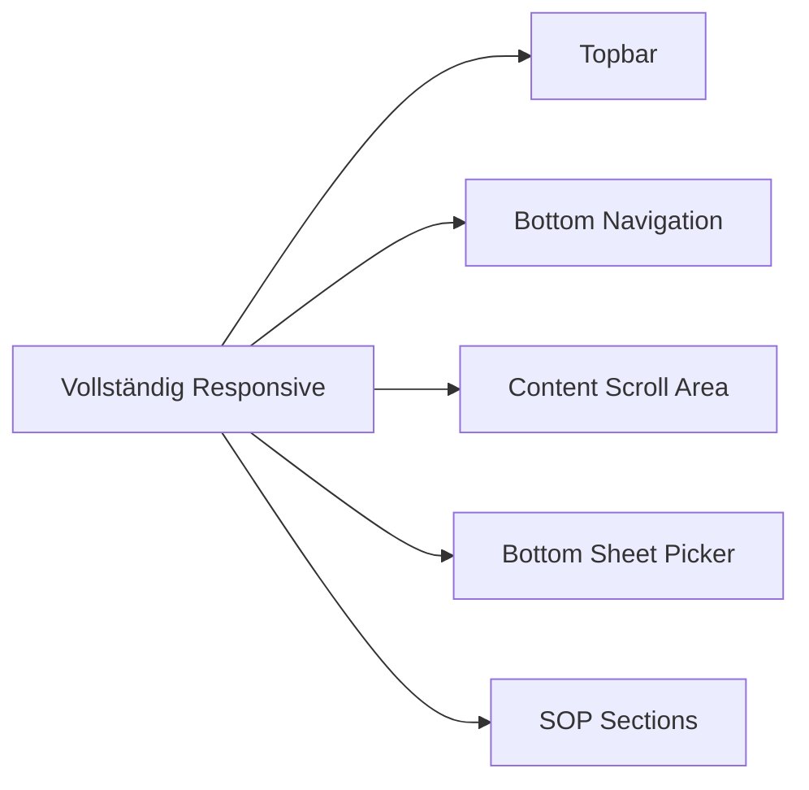
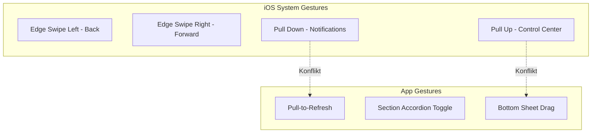

# Mobile-Optimierungsanalyse: Patientenpfade ZNA

## Zielgerät: iPhone 14 Pro Max

### Gerätespezifikationen
| Eigenschaft | Wert |
|-------------|------|
| Bildschirmgröße | 2796 × 1290 Pixel |
| Logische Auflösung | 430 × 932 px (3x Retina) |
| Safe-Area-Top | 59 px (Dynamic Island) |
| Safe-Area-Bottom | 34 px (Home Indicator) |
| Safe-Area-Left/Right | 0 px |

---

## 1. Analyse der aktuellen Dateien

### 1.1 index.html - Struktur und Meta-Tags

#### Bereits vorhandene Mobile-Optimierungen:

```html
<meta name="viewport" content="width=device-width, initial-scale=1.0, maximum-scale=5.0, viewport-fit=cover">
```
- ✅ `viewport-fit=cover` für Fullscreen-Darstellung
- ✅ `maximum-scale=5.0` erlaubt Zoom für Accessibility

```html
<meta name="apple-mobile-web-app-capable" content="yes">
<meta name="apple-mobile-web-app-status-bar-style" content="black-translucent">
```
- ✅ PWA-fähig für Standalone-Modus
- ✅ Transluzente Status-Bar für Fullscreen

#### Interaktive Elemente (nach Kategorie):

| Element | Typ | Position |
|---------|-----|----------|
| `.sidebar-search input` | Texteingabe | Sidebar |
| `.sidebar-cat-toggle` | Button | Sidebar |
| `.sidebar-cat-chip` | Filter-Chips | Sidebar |
| `.topbar-back` | Navigation | Topbar |
| `.topbar-btn` | Aktionen | Topbar |
| `.btm-btn` | Navigation | Bottom |
| `.cat-card` | Kachel | Content |
| `.browse-item` | Listenitem | Content |
| `.sop-section-head` | Akkordeon | Content |
| `.fab` | Floating Action | Fixed |
| `.picker-sheet` | Bottom Sheet | Overlay |

### 1.2 styles.css - Responsive Design

#### Safe-Area-Implementierung (ZEILE 12-16):

```css
--sat: env(safe-area-inset-top, 0px);
--sab: env(safe-area-inset-bottom, 0px);
--sal: env(safe-area-inset-left, 0px);
--sar: env(safe-area-inset-right, 0px);
```

**Bewertung:** ✅ Korrekt implementiert mit CSS Environment Variables

#### Breakpoints:

| Breakpoint | Zielgerät |
|------------|-----------|
| > 1023px | Desktop (Sidebar sichtbar) |
| ≤ 1023px | Tablet/Mobile (Topbar + Bottom Nav) |
| ≤ 480px | Kleine Mobile |

#### Safe-Area-Verwendung:

| Komponente | Safe-Area | Status |
|------------|-----------|--------|
| `.topbar` | `padding-top: var(--sat)` | ✅ Korrekt |
| `.btm-nav` | `padding-bottom: var(--sab)` | ✅ Korrekt |
| `.picker-sheet` | `padding-bottom: var(--sab)` | ✅ Korrekt |
| Content-Padding | `padding-left/right: calc(X + var(--sal/sar))` | ✅ Korrekt |
| `.fab` | `bottom: calc(80px + var(--sab))` | ✅ Korrekt |

#### Touch-Target-Größen (Apple HIG: min. 44×44px):

| Element | Aktuelle Größe | HIG-Konform |
|---------|----------------|--------------|
| `.topbar-btn` | `min-width: 44px; min-height: 44px` | ✅ |
| `.btm-btn` | `min-height: 48px` | ✅ |
| `.picker-head button` | `min-width: 44px; min-height: 44px` | ✅ |
| `.picker-list li` | `min-height: 48px` | ✅ |
| `.browse-item` | `min-height: 50-54px` | ✅ |
| `.sop-section-head` | `min-height: 48-52px` | ✅ |
| `.sidebar-cat-chip` | `padding: 3px 8px` (~24px) | ❌ Zu klein |
| `.browse-cat-chip` | `min-height: 40px` | ⚠️ Grenzwertig |
| `.topbar-btn-sm` | `min-height: 32px` | ❌ Zu klein |
| `.sidebar-font button` | `padding: 3px 8px` (~24px) | ❌ Zu klein |

### 1.3 app.js - Touch-Events und Interaktionen

#### Pull-to-Refresh Implementierung (ZEILE 206-237):

```javascript
E.contentScroll.addEventListener('touchstart', function(e) {
    if(E.contentScroll.scrollTop===0){
        S.pY0=e.touches[0].clientY;S.pull=true;
    }
},{passive:true});
```

**Analyse:**
- ✅ `passive:true` für bessere Scroll-Performance
- ⚠️ Potenzieller Konflikt mit iOS Edge-Swipe
- ⚠️ Keine Schwellenwert-Validierung für minimale Swipe-Distanz

#### Touch-Event-Handler im Überblick:

| Event | Element | Zweck |
|-------|---------|-------|
| `touchstart` | `.contentScroll` | Pull-to-Refresh Start |
| `touchmove` | `.contentScroll` | Pull-to-Refresh Bewegung |
| `touchend` | `.contentScroll` | Pull-to-Refresh Ende |
| `click` | Diverse Buttons | Navigation/Aktion |

---

## 2. Mobile-Optimierungsbedarf

### 2.1 Bereits responsive Bereiche:



### 2.2 Optimierungsbedarf für Touch-Bedienung:

| Priorität | Element | Problem | Lösung |
|-----------|---------|---------|--------|
| HOCH | `.sidebar-cat-chip` | 24px Touch-Target | Auf 44px erhöhen |
| HOCH | `.topbar-btn-sm` | 32px Touch-Target | Auf 44px erhöhen |
| HOCH | `.sidebar-font button` | 24px Touch-Target | Auf 44px erhöhen |
| MITTEL | `.browse-cat-chip` | 40px Touch-Target | Auf 44px erhöhen |
| MITTEL | Pull-to-Refresh | Konflikt mit iOS-Gesten | Schwellenwert anpassen |

### 2.3 iOS-Systemgesten-Konflikte:



**Identifizierte Konflikte:**

1. **Pull-to-Refresh vs. Notification Center**
   - Position: Oberer Bildschirmrand
   - Risiko: Mittel (nur bei scrollTop===0)
   - Empfehlung: `preventDefault()` bei aktivem Pull

2. **Bottom Sheet vs. Control Center**
   - Position: Unterer Bildschirmrand
   - Risiko: Hoch
   - Empfehlung: `touch-action: manipulation` für Picker

### 2.4 Safe-Area-Probleme:

| Bereich | Problem | Schwere |
|---------|---------|---------|
| Dynamic Island | Topbar-Content könnte überdeckt werden | ⚠️ Mittel |
| Home Indicator | FAB könnte überdeckt werden | ✅ Gelöst |
| Landscape Left/Right | Safe-Area-Left/Right nicht getestet | ⚠️ Prüfen |

---

## 3. iPhone 14 Pro Max Spezifische Anforderungen

### 3.1 Safe-Area-Insets für CSS:

```css
/* iPhone 14 Pro Max Werte */
--safe-area-top: 59px;    /* Dynamic Island */
--safe-area-bottom: 34px; /* Home Indicator */
--safe-area-left: 0px;    /* Portrait */
--safe-area-right: 0px;   /* Portrait */

/* Landscape */
--safe-area-left: 59px;   /* Dynamic Island Links */
--safe-area-right: 0px;
```

### 3.2 Dynamic Island Überdeckungs-Risiko:

```
┌─────────────────────────────────────┐
│ ▓▓▓▓▓▓▓▓                            │  ← Dynamic Island (59px)
│                                     │
│          TOPBAR (56px + 59px)       │
│                                     │
├─────────────────────────────────────┤
│                                     │
│                                     │
│          CONTENT AREA               │
│                                     │
│                                     │
├─────────────────────────────────────┤
│          BOTTOM NAV (64px + 34px)   │
│                                     │
│ ▬▬▬▬▬▬▬▬▬▬▬▬▬▬▬▬▬▬▬▬▬▬▬▬▬▬▬▬▬▬▬▬▬▬ │  ← Home Indicator (34px)
└─────────────────────────────────────┘
```

---

## 4. Empfehlungen

### 4.1 Touch-Target-Größen (Apple HIG: 44×44px Minimum)

#### Kritische Anpassungen:

```css
/* Empfohlene Änderungen */

/* 1. Sidebar Category Chips */
.sidebar-cat-chip {
    min-height: 44px;
    padding: 10px 12px;
}

/* 2. Topbar Font Buttons */
.topbar-btn-sm {
    min-width: 44px;
    min-height: 44px;
}

/* 3. Sidebar Font Controls */
.sidebar-font button {
    min-width: 44px;
    min-height: 44px;
}

/* 4. Browse Category Chips */
.browse-cat-chip {
    min-height: 44px;
}
```

### 4.2 Gesten-Implementierung ohne Konflikte

#### Pull-to-Refresh Optimierung:

```javascript
// Empfohlene Verbesserungen
var PULL_THRESHOLD = 80; // Erhöhter Schwellenwert
var EDGE_MARGIN = 30;    // Randbereich ausschließen

E.contentScroll.addEventListener('touchstart', function(e) {
    // Edge-Swipe-Bereich ausschließen
    if(e.touches[0].clientX < EDGE_MARGIN || 
       e.touches[0].clientX > window.innerWidth - EDGE_MARGIN) {
        S.pull = false;
        return;
    }
    if(E.contentScroll.scrollTop === 0) {
        S.pY0 = e.touches[0].clientY;
        S.pull = true;
    }
}, {passive: true});
```

#### Touch-Action für Bottom Sheet:

```css
.picker-sheet {
    touch-action: pan-y; /* Nur vertikales Scrollen */
}

.picker-list {
    touch-action: pan-y;
    overscroll-behavior: contain; /* Bounce begrenzen */
}
```

### 4.3 Viewport und Meta-Tags

#### Empfohlene Ergänzungen:

```html
<!-- Zusätzliche Meta-Tags für iOS -->
<meta name="apple-mobile-web-app-title" content="Patientenpfade">

<!-- Verhindert Telefonnummer-Erkennung -->
<meta name="format-detection" content="telephone=no">
<!-- ✅ Bereits vorhanden -->

<!-- Theme-Color für Dark Mode -->
<meta name="theme-color" content="#ffffff" media="(prefers-color-scheme: light)">
<meta name="theme-color" content="#1e293b" media="(prefers-color-scheme: dark)">
```

### 4.4 CSS-Verbesserungen

#### Safe-Area Fallback für ältere iOS-Versionen:

```css
/* Fallback mit @supports */
@supports(padding: max(0px)) {
    .topbar {
        padding-top: max(14px, var(--sat));
        height: max(var(--topbar-h), calc(var(--topbar-h) + var(--sat)));
    }
}
/* ✅ Bereits implementiert (ZEILE 660-671) */
```

#### Zusätzliche Verbesserungen:

```css
/* 1. Verhindert Text-Selection bei schnellem Tippen */
button, .btm-btn, .cat-card, .browse-item {
    -webkit-touch-callout: none;
    user-select: none;
}

/* 2. Optimierte Tap-Highlight-Farbe */
* {
    -webkit-tap-highlight-color: rgba(0,0,0,0.1);
}

/* 3. Smooth Scrolling für iOS */
.scroll-area {
    -webkit-overflow-scrolling: touch;
    overscroll-behavior-y: contain;
}
/* ✅ -webkit-overflow-scrolling bereits vorhanden */
```

---

## 5. Zusammenfassung

### Aktueller Stand:

| Kategorie | Status | Bewertung |
|-----------|--------|-----------|
| Viewport/Meta-Tags | Gut implementiert | ⭐⭐⭐⭐ |
| Safe-Area-Insets | Korrekt implementiert | ⭐⭐⭐⭐⭐ |
| Responsive Breakpoints | Vorhanden | ⭐⭐⭐⭐ |
| Touch-Target-Größen | Teilweise zu klein | ⭐⭐⭐ |
| Gesten-Konflikte | Potenzielle Probleme | ⭐⭐⭐ |
| iOS-spezifische Optimierungen | Basis vorhanden | ⭐⭐⭐ |

### Priorisierte Maßnahmen:

1. **SOFAKTION:** Touch-Target-Größen auf 44px erhöhen
2. **WICHTIG:** Pull-to-Refresh Edge-Case-Handling
3. **EMPFOHLEN:** Touch-Action CSS ergänzen
4. **EMPFOHLEN:** Overscroll-Behavior hinzufügen
5. **OPTIONAL:** Haptic Feedback für wichtige Aktionen

---

## 6. Nächste Schritte

Nach Freigabe dieses Analyseberichts kann die Implementierung in folgenden Schritten erfolgen:

1. CSS-Anpassungen für Touch-Targets
2. JavaScript-Optimierung für Gesten
3. Meta-Tags ergänzen
4. Testing auf iPhone 14 Pro Max
5. Feinjustierung basierend auf Testergebnissen

---

*Analyse erstellt: 10.02.2026*
*Zielgerät: iPhone 14 Pro Max (iOS 17+)*
*Apple Human Interface Guidelines Version: 2024*
